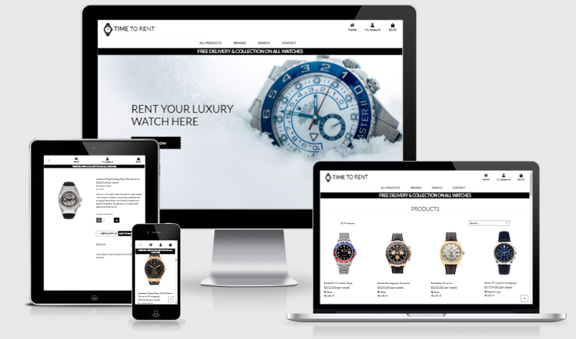

# Time To Rent - an e-commerce site which allows customers to rent luxury watches for up to 12 weeks at a time.

A live demo can be found [here](https://time-to-rent.herokuapp.com/)



## Introduction

Time To Rent is an e-commerce site which enables customers to rent luxury watches on a price per week basis. The watches available would cost between £10k and £300k to purchase from a store and would be unobtainable for the majority of the general public. Most customers would be looking to rent a luxury watch for a special ocassion, such as a wedding, holiday, honeymoon, ceremony, etc. 

The website can be viewed on Desktop, Tablet and Mobile devices. Click [here](https://time-to-rent.herokuapp.com/) to view.


## Table of Content

1. [UX](#ux)
    * [Goals](#goals)
        * [Renovate-it goals](#renovate-it-goals)
        * [Business goals](#business-goals)
        * [Customer goals](#customer-goals)
    * [User Stories](#user-stories)
        * [Renovate-it business](#renovate-it-business)
        * [The potential customer](#the-potential-customer)
         * [The UX designer](#the-ux-designer)
    * [Minimum Viable Product](#minimum-viable-product)
    * [Design](#design)
        * [Colors](#colors)
        * [Font](#font)
    * [Wireframes](#wireframes)
2. [Features](#features)
    * [Existing Features](#existing-features)
        * [Elements seen on the homepage](#elements-seen-on-the-homepage)
        * [Elements seen on the 404 and 500 pages](#elements-seen-on-the-404-and-500-pages)
        * [Elements seen on the top tips page](#elements-seen-on-the-top-tips-page)
        * [Elements seen on the login page](#elements-seen-on-the-login-page)
        * [Elements seen on the signup page](#elements-seen-on-the-signup-page)
        * [Elements seen on the profile page](#elements-seen-on-the-profile-page)
        * [Elements seen on the edit page](#elements-seen-on-the-edit-page)
        * [Elements seen on the add tips page](#elements-seen-on-the-add-tips-page)
        * [Logout function](#logout-function)
    * [Features left to implement](#features-left-to-implement)
    * [Bugs and Fixes for Future Releases After Testing](#bugs-and-fixes-for-future-releases-after-testing)
3. [Technologies Used](#technologies-used)
4. [Testing](#testing)
5. [Deployment](#deployment)
    * [Hosting on GitHub Pages](#hosting-on-github-pages)
    * [How to run this project locally](#how-to-run-this-project-locally)
6. [Credits](#credits)
    * [Media](#media)
    * [Acknowledgements](#acknowledgements)
        * [Examples and Tutorials and Samples](#examples-and-tutorials-and-samples)
        * [Pages used for information](#pages-used-for-information)
        * [I received advice and encouragement from](#i-received-advice-and-encouragement-from)
7. [Disclaimer](#disclaimer)

## UX

### Goals

#### Renovate-it goals

The goal of this website is to allow users, who cannot afford to buy a luxury watch, the ability to rent a luxury watch at a price per week for up to 12 weeks at a time. 

Target audience is:

* People who cannot afford to buy a luxury watch.
* People who would like to wear a different watch for a specific reason/ocassion.
* People who like to change their watches throughout the year.
* People who have a special ocassion to attend.
* Any age group.
 

#### Business goals

* Interactive website.
* Fully functional website.
* Intuitive design.
* Easy to navigate.
* To have as many registered users as possible.
* Daily increases in user numbers.
* Daily increases in reviews being added.
* Make it as easy as possible for customers to complete a rental purchase.
* Interactive communications with the customers at every stage of the rental process.


#### Customer goals

* Easy to navigate.
* Easy to search for specific keywords.
* Easily locate a product.
* Easy to add and edit information.
* Easy to register and login securley.
* Email communication when an action is completed.


Both business and customer goals are addressed through user stories.


### User Stories

#### Renovate-it business

* As a business, I want my website to display clean, sleek lines and mechanical colours.
* As a business, I want my website to display simple to follow instructions.
* As a business, I want my website to be responsive on all devices.
* As a business, I want a strong focus on mobile usability as most users will be veiwing the website on mobile devices.
* As a business, I want my website to be interactive and offer real time feedback.
* As a business, I want my website to load quickly.
* As a business, I want my website to display clear high resolution images.
* As a business, I want my website to be usable for both left and right handed users.
* As a business, I want my website to have a low risk of accidently clicking more than one button at once on smaller screens sizes.
* As a business, I want my website to have a search function.
* As a business, I want my website to have a admin login so the site can be managed.

#### The potential customer

* As a customer, I want the website to be responsive on all devices.
* As a customer, I want to be able to access all of the pages from the Homepage.
* As a customer, I want to be able to conduct a keyword search from any page.
* As a customer, I want to be able to easily register an account.
* As a customer, I want to be able to easily login.
* As a customer, I want to be able to easily search by brand.
* As a customer, I want to be able to set my profile prefences.
* As a customer, I want to be able to access my basket from any page.
* As a customer, I want to be able to access the Homepage from any page.
* As a customer, I want to be able to adjust the items in the basket.
* As a customer, I want to be able to see real time feedback when compelting an action.
* As a customer, I want to be able to recieve email communications confirming the actions completed.
* As a customer, I want to be able to read reviews on each product.
* As a customer, I want to be able to add/edit/delete my own reviews.
* As a customer, I want to be able to contact the business for any reason and to recieve confirmation of this action.
* As a customer, I want to be able to view my past purchase history.

#### The UX designer

* As a UX designer, I want to track the user behaviour so that I can improve the user experience.
    * As a UX designer, I want to track the user behaviour so that I can identify the possible user confusion over navigating the website.
* As a UX designer, I want to focus on the mobile design as most users will be using the website on a mobile device.
* As a UX designer, I want the website to be intercative and give real time feedback when a user executes an action.
  

### Minimum Viable Product

All the User Stories have been assessed against value and complexity. Due to the relatively short time for the implementation of the website, only the MVPs will be implemented in the first release.


### Design

#### Colors

Following colours have been used:
*  #222 (Mine Shaft) 
*  #6c757d (Pompeii Ash) 
*  #aab7c4 (Cadet Blue) 
*  #000 (Black)    
*  #212529 (Blue Charcoal) 
*  #555 (Davy's Grey) 
*  #fff (White)
*  #17a2b8 (Cyan Blue) 


#### Font

The Font I used for this project is **Lato** with the font weights: 
* 300
* 400
* 500

The [Lato](https://fonts.google.com/specimen/Yellowtail?query=yellow) font was chosen for it's easy readability and it's mechanical appearence.

### Wireframes

I decided that it would be more helpful to have mockups than simple wireframes. The mockups were built in [figma](https://www.figma.com/). 

Link to the mockups can be found [here](https://www.figma.com/file/fkOYNcpb1G4whUHj7TskjS/Renovate.IT?node-id=0%3A1). The mockups were designed for the mobile first approach. I have produced a desktop, tablet and mobile mockup of the main pages.

If you are unable to access the mockup links above please see the mockup images [here](https://github.com/Gmanprodev/Renovate-it/tree/master/documentation/wireframes).

## Features

### Existing Features

* **Responsive Design**
    * Fully responsive website across all popular devices, using Bootstrap Grid and custom media queries.

* **Responsive Navigation Menu**
    * Intuitive and responsive Navigation menu.

* **Registration & Login Forms**
    * Login and Registration pages with forms.

* **Search Functionality**
    * Search bar available on all pages with the ability to locate any keywords.

* **Homepage Navigation**
    * Ability to naviagte to the Homepage from anywhere on the site.

* **Product Reviews**
    * Each individual watch has a reviews section which users can add/edit/delete from when logged in.

* **Shopping Bag Summary**
    * Once a user has added products to the shopping bag it can be viewed as a summary on a new page and allow the user to update/delete the details.

* **Checkout**
    * The checkout page allows the user to enter personal/payment details to complete the transaction.

* **Checkout Success Page**
    * Thsi confirms to the user that the payment has been successful or not.

* **Order Confirmation Email**
    * User will recieve an email confirming the details of their rental purchase.

* **Contact**
    * A contact form which allows users to contact the business and the user recieves a confirmation email once successfully completed.

* **404 & 500 Pages**
    * Customised pages to fit in with the rest of the website.


### Features left to implement

* **Product Ratings** - The site currently shows ratings for each product, however this is hard wired into the database and cannot be changed by the users. For the next release I would like to create the functionality so that users can score each watch with a rating which displays in real time.
* **Tracking User Behaviour** - Use an analytics tool such as [Hotjar](https://www.hotjar.com/) to view user behaviour.
* **Most and Least Visited Pages on the Site** - Use an analytics tool such as [Hotjar](https://www.hotjar.com/) to understand where the traffic is going on the site.


### Bugs and Fixes for Future Releases After Testing
 
* **Image Size and Hosting** - The Lighthouse Audit Report will show better performance.
* **Social Media Links in Footer** - The social media icons are linked to the correct pages, however these are currently generic login pages. These will direct you to the company specific pages in future releases. They could also do with more space between the icons.

## Technologies Used

### Languages

* HTML
* CSS
* JavaScript/Jquery
* Python

### Database

* MongoDB - document key vaue pairs database.
* Data Schema - 
Click [here](https://github.com/Gmanprodev/Renovate-it/blob/master/documentation/testing/test_images/data_schema.jpg?raw=true)

### Libraries/Frameworks

* [Bootstrap](https://getbootstrap.com/) - used for responsive grid system, styling and modals.
* [JQuery](https://jquery.com/) - were used in conjunction with the Materialize library.
* [FontAwseome](https://fontawesome.com/) - used for all icons on the site.
* [Google Fonts](https://fonts.google.com/) - used for the Lato font.
* [Unsplash](https://unsplash.com/) - used for images.
* [Favicon.io](https://favicon.io/) - used for creating a favicon.
* [Django](https://www.djangoproject.com/) - a Python framework.


### Media Storage

* [AWS](https://aws.amazon.com/) - cloud storage for static and media files.


### Tools

* [Gitpod](https://www.gitpod.io) - used as IDE for this project.
* [Git](https://git-scm.com/) - used for version control.
* [Github](https://github.com/) - used to host repository.
* [Heroku](https://www.heroku.com/) - used to deploy.
* [Figma](https://www.figma.com/) - used for creation of mockups.
* [Am I Responsive](http://ami.responsivedesign.is/) - used for testing purposes as well as creating the image to display the web pages on different devices.
* [Google Chrome DevTools](https://developers.google.com/web/tools/chrome-devtools) - used for testing and debugging.
* [PageSpeed insights](https://developers.google.com/speed/pagespeed/insights/) - used for testing the loading speed of the site.
* [Lighthouse Audit](https://developers.google.com/web/tools/lighthouse) - used to test whether the site meets the standards expected.
* [w3 html validator](https://validator.w3.org/) - used to test and validate my html code.
* [w3 css validator](https://jigsaw.w3.org/) - used to test and validate my css code.
* [Free Formatter](https://www.freeformatter.com/) - used to format my html, css and javascript code.
* [Browserstack](https://www.browserstack.com/) - used to test my site on different browsers.
* [Color Scheme Designer](http://colorschemedesigner.com/) - used to test colour combinations.
* [jshint](https://jshint.com/) - used to validate my Javascript code.
* [PEP8](http://pep8online.com/) - used to validate my Python code.


## Testing

### For testing the Stripe checkout use the following:
```
Card number: 4242 4242 4242 4242
CVC_: any 3 digits
Card expiry date: any future date
ZIP/Postcode: any 5 digits
```
For further tests, different card info can be found in the [Stripe Documentation](https://stripe.com/docs/testing#cards).

Testing information can be found [here](documentation/testing/testing.md).


## Deployment

### Project Creation
- To create this project the used the [CI Gitpod Full Template](https://github.com/Code-Institute-Org/gitpod-full-template).
- I was then directed to the create a new repository from the template page and entered in my desired repository name, then clicked create
repository.
- Once created, I navigated to my new repository on GitHub and clicked the Gitpod button which built my workspace.

### Local Installation
1. Save a copy of the GitHub [repository](https://github.com/Gmanprodev/Time-To-Rent) by clicking the `download.zip` button at the top of the page 
and extracting the zip file, or you clone the repository with this command:
```
$ git clone https://github.com/Gmanprodev/Time-To-Rent.git
```
2. Copy the repository into your IDE.
3. Install all required modules with the command:
```
pip3 install -r requirements.txt
```
4. Store your environment variables and save them in the `Environment Variables-Settings` in your IDE:
```
DEVELOPMENT - Set to True
SECRET_KEY - From a free Django Secret Key Generator
STRIPE_PUBLIC_KEY - From Developer's API on the Stripe dashboard
STRIPE_SECRET_KEY - From Developer's API on the Stripe dashboard
STRIPE_WH_SECRET - From Stripe's developer API after creating a webhook
```
5. Set up the local database running the following commands:
```
python3 manage.py makemigrations
python3 manage.py migrate
```
6. Create a superuser to access the Django Admin Panel with the command:
```
python3 manage.py createsuperuser
```
7. Start your server running the following command:
```
python3 manage.py runserver
```

### Remote Deployment on Heroku

#### Create application
1. Setup and account and log in to Heroku.
2. Click on the `new` button.
3. Select create `new app`.
4. Enter the app name.
5. Select region.
 
#### Set up connection to Github Repository:
1. Click the `Deploy tab`.
2. `Select GitHub - Connect to GitHub`.
3. A prompt to find a Github repository to connect to will be displayed.
4. Enter the repository name for the project and `Click Search`.
5. Once the repo has been found, click the `Connect Button`.

#### Set environment variables:
1. Click on the `Settings tab`.
2. Click `Reveal Config Vars`.
3. Variables added:
```
AWS_ACCESS_KEY_ID
AWS_SECRET_ACCESS_KEY
DATABASE_URL
EMAIL_HOST_PASSWORD
EMAIL_HOST_USER
SECRET_KEY
STRIPE_PUBLIC_KEY
STRIPE_SECRET_KEY
STRIPE_WH_SECRET
USE_AWS
```

#### Enable automatic deployment:
1. Click the `Deploy tab`.
2. In the Automatic Deploys section, choose the branch you want to deploy.
3. Click `Enable Automation Deploys`.


### Credits

#### Content

* All of the watch descriptions were copied from various online watch retailers.

### Media

#### All Images

* All of the watch images were copied from various online watch retailers.


### Acknowledgements

#### Examples and Tutorials and Samples

* [Code Institute](https://codeinstitute.net/) - I used the Ado Boutique mini project tutorials to build the bulk of my website and then customised the products on offer. I also built a custom CONTACT app and a REVIEWS model/view in the PRODUCTS app.
   

#### Pages used for information

* [W3schools](https://www.w3schools.com/)
* [W3C](https://www.w3.org/)
* [Stack overflow](https://stackoverflow.com/)
* [CSS-Tricks](https://css-tricks.com/)
* [MDN web docs](https://developer.mozilla.org/)
* [Codepen](https://codepen.io/)

#### I received advice and encouragement from
   * Akshat (my mentor)
   * Tutor Support (CI online webchat)
   * Henrique Peroni (fellow student)

## Disclaimer

**This web page was created for educational purposes only.** 
